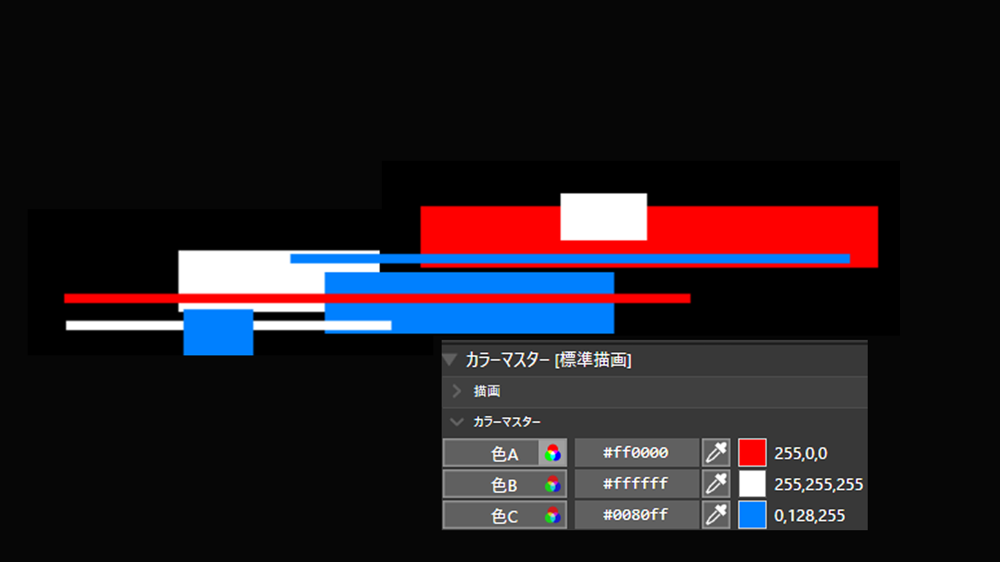
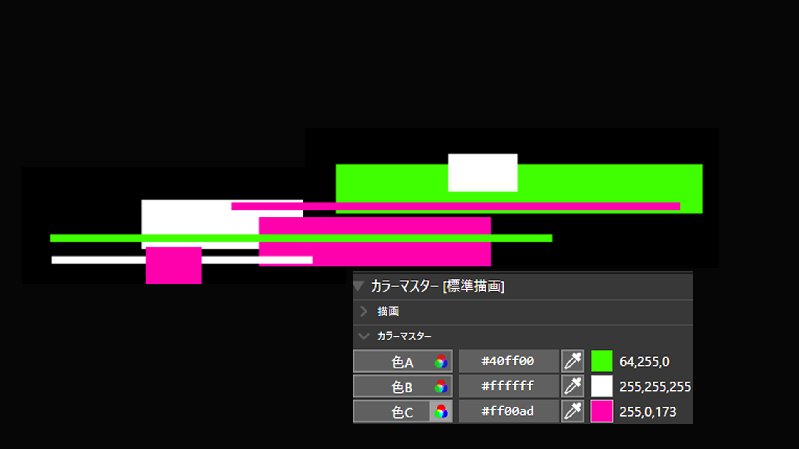

# ColorLink

AviUtl2用のカラー連動スクリプトです。
複数の図形や画像に「カラーリンク」を追加し、
1つの「カラーマスター」から色をまとめて変更できます。

カラーマスターには「色A」「色B」「色C」の3色があり、
カラーリンク側で対応するカラーグループを選択します。

## 概要
ColorLinkは、複数のオブジェクトの色を
1つのカラーマスターからまとめて変更するための
AviUtl2用スクリプトです。

カラーマスターには以下の3色があります。
- 色A
- 色B
- 色C

カラーリンクを追加したオブジェクト側では、
カラーグループ A / B / C のいずれかを選択します。

カラーマスターの色を変更すると、
同じカラーグループを使用しているオブジェクトへ反映されます。

## 主な機能
- 3色のマスターカラーを一括管理
- カラーグループ A / B / C に対応
- 最も近い上側のカラーマスターを自動参照
- マスターレイヤー番号の指定不要
- 複数のカラーマスターを同一タイムライン内で使用可能
- カラーマスターが見つからない場合は何も処理しない

## インストール
配布ZIPをAviUtl2へ導入してください。

手動で導入する場合は、以下のフォルダを
`C:\ProgramData\aviutl2\Script\`
へ配置してください。

ColorLink/
├─ カラーマスター.obj2
└─ カラーリンク.anm2

AviUtl2を起動したまま導入した場合は、
再起動してください。

## 基本的な使い方
1. タイムラインに「カラーマスター」を追加します。
2. カラーマスターより下のレイヤーに、色を変更したいオブジェクトを配置します。
3. 対象オブジェクトへ「カラーリンク」を追加します。
4. カラーリンクの「カラーグループ」から A / B / C を選択します。
5. カラーマスターの色A / 色B / 色Cを変更します。

## カラーマスターの検索について
カラーリンクは、
自分より上にあるレイヤーを順番に検索し、
最も近い「カラーマスター」を自動的に参照します。

そのため、マスターレイヤー番号を手動で指定する必要はありません。

### 複数のカラーマスターを使用する場合
Layer 10  カラーマスター①
Layer 11  図形
Layer 12  図形

Layer 20  カラーマスター②
Layer 21  図形
Layer 22  図形

Layer 11～12のカラーリンクはカラーマスター①を、
Layer 21～22のカラーリンクはカラーマスター②を参照します。
3色を超える色数が必要な場合も、
別のカラーマスターを追加することで対応できます。

## カラーマスターが見つからない場合
カラーリンクより上にカラーマスターが存在しない場合、
カラーリンクは何も処理しません。

元のオブジェクト設定自体を書き換えることはありません。

## 注意事項
カラーリンクは描画時に、
自分より上のレイヤーからカラーマスターを検索します。

大量のカラーリンクを使用する場合や、
カラーマスターと対象オブジェクトのレイヤーが
極端に離れている場合は、
処理負荷が増える可能性があります。

## 対応環境
- AviUtl2

## 詳しい使い方
説明動画を公開予定です。
公開後、この項目に動画リンクを追加します。

## ライセンス
MIT License
詳細は LICENSE を確認してください。

改変・再配布・商用利用が可能です。
再配布等を行う場合は、MIT Licenseの条件に従ってください。

## 更新履歴
更新内容は CHANGELOG を確認してください。

## ダウンロード
正式版はGitHub Releasesからダウンロードできます。

## 作者
作者名：犬好アトム

## リンク
- 説明動画：公開予定
- ニコニ・コモンズ：登録予定
- AviUtl2カタログ：登録予定
